# Ranhentos Idiomas — CRUD Laravel + React

Sistema de gestão para escola de idiomas: cadastro de **alunos**, **cursos**, **matrículas** (relação aluno–curso) e **relatórios** com gráficos. O backend é uma API REST em **Laravel** e o frontend é uma SPA em **React** servida pelo **Vite**.

---

## Pré-requisitos

| Ferramenta | Versão sugerida |
|------------|-----------------|
| [PHP](https://www.php.net/) | **8.4+** (compatível com `composer.json`) |
| [Composer](https://getcomposer.org/) | 2.x |
| [Node.js](https://nodejs.org/) | 18+ (LTS) e npm |
| Banco de dados | **SQLite** (mais simples) ou **MySQL** / **PostgreSQL** |

Extensões PHP úteis: `openssl`, `pdo`, `mbstring`, `tokenizer`, `xml`, `ctype`, `json`, `fileinfo` (o projeto exige `ext-pdo`).

---

## Como rodar localmente

### 1. Clonar e instalar dependências do PHP

```bash
composer install
```

### 2. Arquivo de ambiente (`.env`)

Este repositório não inclui `.env.example`. Crie um arquivo `.env` na raiz do projeto com, no mínimo:

```env
APP_NAME="Ranhentos Idiomas"
APP_ENV=local
APP_KEY=
APP_DEBUG=true
APP_URL=http://127.0.0.1:8000

# URL da API vista pelo React (obrigatório em desenvolvimento local)
VITE_API_URL=http://127.0.0.1:8000/api

# Opcional: CORS (frontend em outra origem, ex.: Vite na porta 5173)
# CORS_ALLOWED_ORIGINS=http://localhost:5173

# --- SQLite (recomendado para desenvolvimento rápido) ---
DB_CONNECTION=sqlite
# Se não definir DB_DATABASE, o Laravel usa database/database.sqlite (veja config/database.php).
# Opcional: DB_DATABASE=C:\caminho\completo\database.sqlite

# --- MySQL (exemplo) ---
# DB_CONNECTION=mysql
# DB_HOST=127.0.0.1
# DB_PORT=3306
# DB_DATABASE=ranhentos_idiomas
# DB_USERNAME=root
# DB_PASSWORD=
```

Gere a chave da aplicação:

```bash
php artisan key:generate
```

**SQLite:** se ainda não existir o arquivo, crie-o:

```bash
# Windows (PowerShell), na raiz do projeto
New-Item -ItemType File -Path database\database.sqlite -Force
```

### 3. Banco de dados, migrações e seed (dados de exemplo)

```bash
php artisan migrate
php artisan db:seed
```

Os seeders populam alunos, cursos e matrículas fictícias para testes.

### 4. Backend (API Laravel)

```bash
php artisan serve
```

A API ficará em `http://127.0.0.1:8000`. Os endpoints REST estão sob o prefixo padrão `/api` (por exemplo `GET /api/students`).

**Saúde da API:** `GET http://127.0.0.1:8000/up`

### 5. Frontend (React + Vite)

Em **outro terminal**, na raiz do projeto:

```bash
npm install
npm run dev
```

O Vite costuma subir em `http://localhost:5173`. O React usa `VITE_API_URL` definido no `.env` para chamar a API (veja `resources/js/services/api.js`). Sem `VITE_API_URL`, o fallback aponta para o deploy em produção na Render.

**Dica:** após alterar variáveis `VITE_*`, reinicie o `npm run dev`.

### 6. (Opcional) Tudo junto com Composer

O `composer.json` define o script `dev` que usa `concurrently` para subir servidor Laravel, fila, logs e Vite. Exige dependências já instaladas (`npm install` na raiz):

```bash
composer run dev
```

Se preferir apenas API + frontend sem fila/logs, use dois terminais (`php artisan serve` e `npm run dev`) como acima.

### 7. Build de produção do frontend

```bash
npm run build
```

Saída em `dist/` (configurado no `vite.config.js`).

---

## Tecnologias utilizadas

| Tecnologia | Papel no projeto |
|------------|------------------|
| **Laravel 13** | Framework PHP: rotas API, Eloquent ORM, migrações, validação, CORS, testes |
| **PHP 8.4** | Runtime do servidor e da CLI Artisan |
| **Laravel Sanctum** | Pacote incluído para autenticação API/token (base do ecossistema Laravel API) |
| **SQLite / MySQL / PostgreSQL** | Persistência via camada PDO (`config/database.php`) |
| **React 18** | Interface em componentes funcionais |
| **Vite 5** | Bundler e servidor de desenvolvimento com HMR |
| **React Router 6** | Navegação entre telas (alunos, cursos, matrículas, relatórios) |
| **Axios** | Cliente HTTP para consumir a API Laravel |
| **Tailwind CSS** | Estilização utilitária (`index.html` usa CDN; build pode usar plugin Vite/Tailwind conforme `package.json`) |
| **Chart.js + react-chartjs-2** | Gráficos nos relatórios |
| **@heroicons/react** | Ícones na UI |
| **PHPUnit 12** | Testes de feature/unit em `tests/` |
| **Faker / Factories** | Dados fictícios para seeds e testes |

---

## Visão geral da interface (screenshots)

As imagens em `screenshots/` ilustram os fluxos principais: listagem, inclusão e edição.

### Alunos

Listagem, cadastro e edição de alunos (`name`, `email`, `phone`).

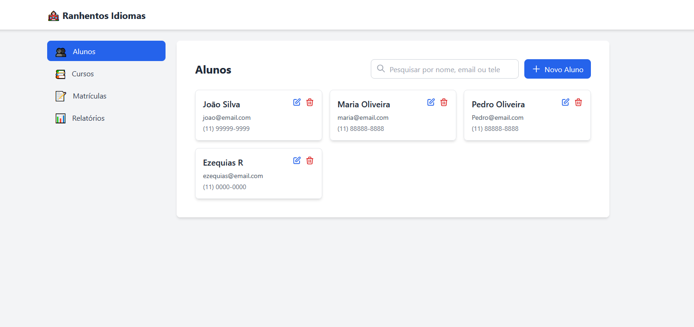

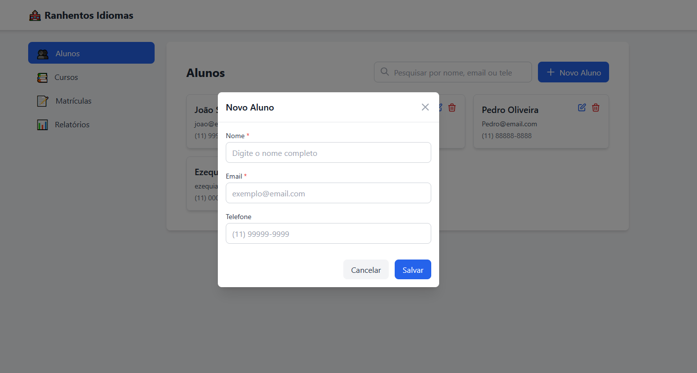

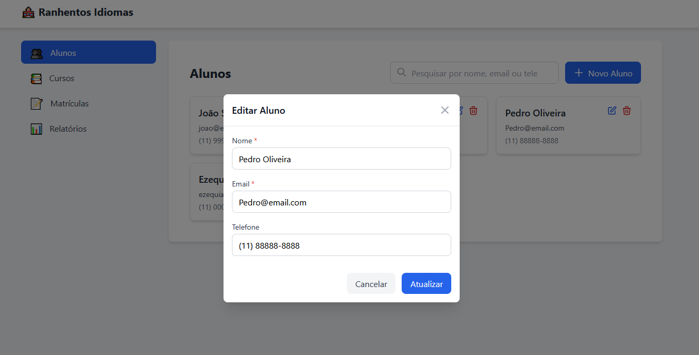

### Cursos

Listagem, cadastro e edição de cursos (nome, descrição, duração, preço, vagas).

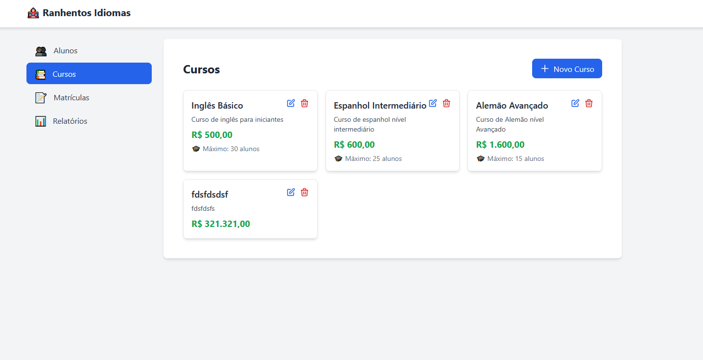

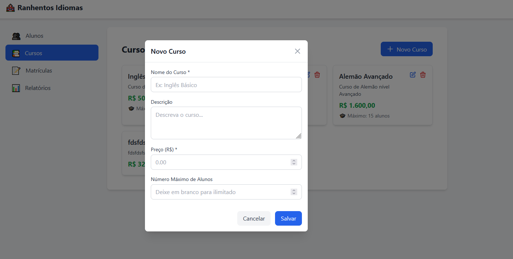

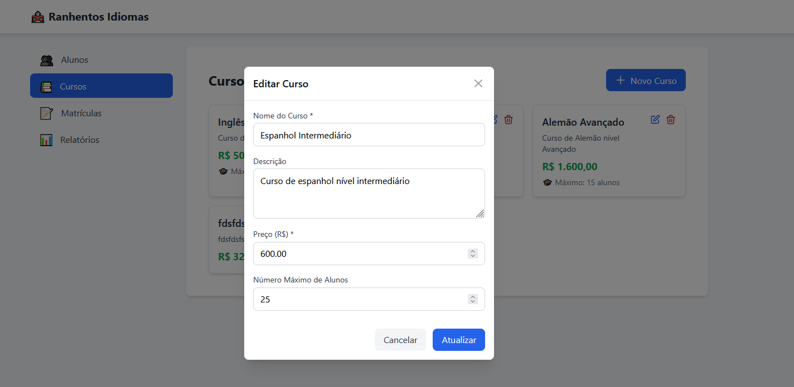

### Matrículas

Matrícula liga um aluno a um curso, com data de início, valor pago e status.

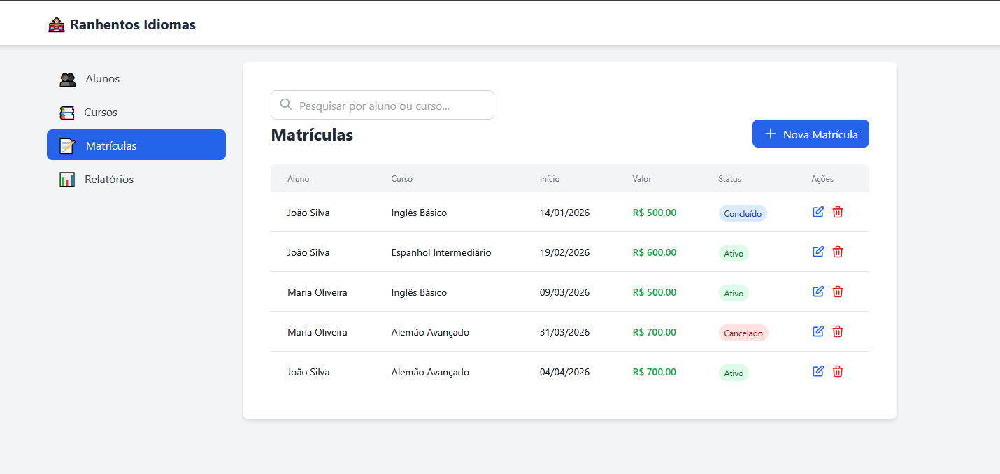

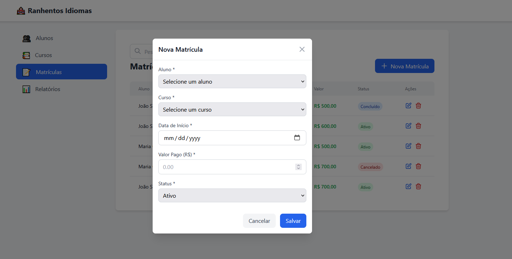

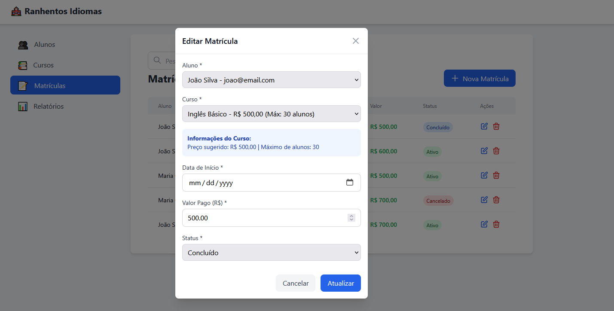

### Relatórios

Painel com indicadores e gráficos (investimento por aluno, cursos populares, receita por curso, dashboard agregado).

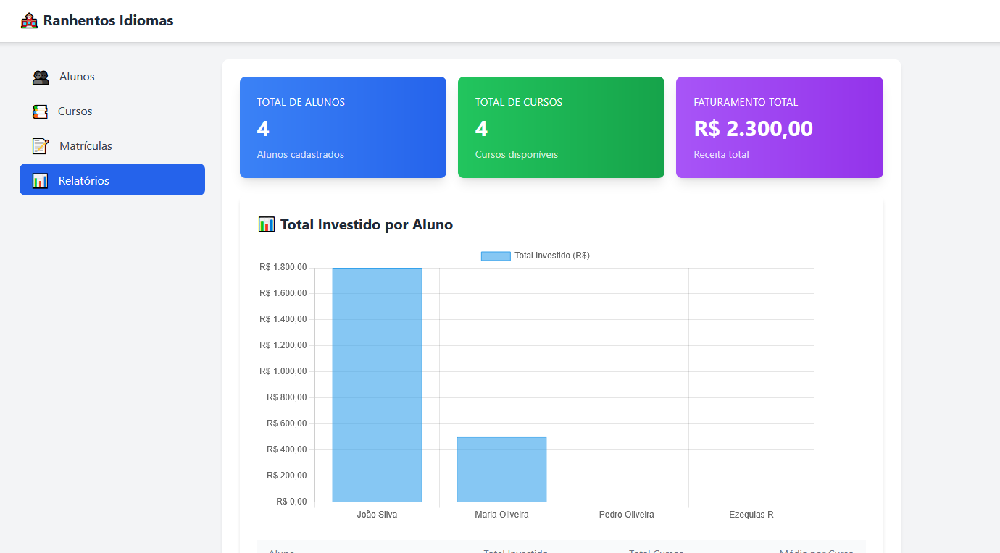

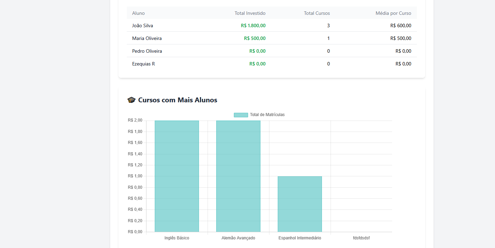

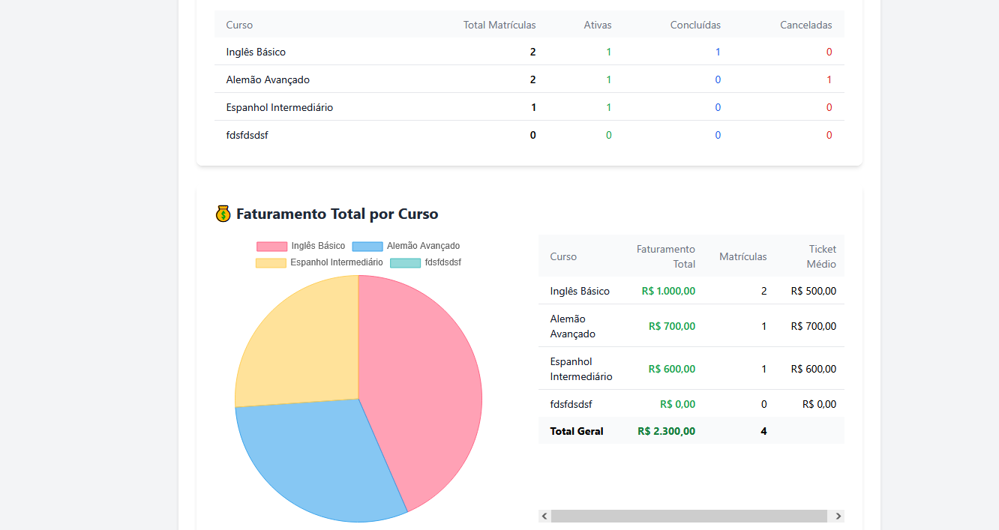

---

## Schema do banco de dados

As tabelas são definidas nas migrações em `database/migrations/`. Relações no Eloquent: `Student` e `Course` têm muitas `Enrollment`; cada `Enrollment` pertence a um `Student` e a um `Course`.

### Tabela `students`

| Coluna | Tipo | Restrições / observações |
|--------|------|---------------------------|
| `id` | BIGINT unsigned | Chave primária auto incremento |
| `name` | VARCHAR(255) | Nome do aluno |
| `email` | VARCHAR(255) | **Único** na base |
| `phone` | VARCHAR(15) | Opcional (`nullable`) |
| `created_at`, `updated_at` | TIMESTAMP | Auditoria Laravel |

**Uso:** cadastro de pessoas que podem se matricular em cursos.

---

### Tabela `courses`

| Coluna | Tipo | Restrições / observações |
|--------|------|---------------------------|
| `id` | BIGINT unsigned | Chave primária |
| `name` | VARCHAR(255) | Nome do curso |
| `description` | TEXT | Opcional |
| `duration` | INTEGER | Opcional; no modelo de negócio pensado como duração em **semestres** |
| `price` | DECIMAL(10,2) | Preço base do curso |
| `max_students` | INTEGER | Opcional; limite de vagas |
| `created_at`, `updated_at` | TIMESTAMP | Auditoria |

**Uso:** oferta de cursos de idiomas com preço e metadados.

---

### Tabela `enrollments`

Representa a **matrícula**: relacionamento N:N entre alunos e cursos, com dados específicos da inscrição.

| Coluna | Tipo | Restrições / observações |
|--------|------|---------------------------|
| `id` | BIGINT unsigned | Chave primária |
| `student_id` | BIGINT unsigned | FK → `students.id`, **cascade** ao excluir aluno |
| `course_id` | BIGINT unsigned | FK → `courses.id`, **cascade** ao excluir curso |
| `start_date` | DATE | Início da matrícula |
| `price_paid` | DECIMAL(10,2) | Valor efetivamente pago nessa matrícula |
| `status` | ENUM | `active` (padrão), `cancelled`, `completed` |
| `created_at`, `updated_at` | TIMESTAMP | Auditoria |

**Uso:** cada linha é uma inscrição de um aluno em um curso, com histórico de valor e situação.

---

## Endpoints da API (resumo)

Recursos REST padrão:

- `GET/POST /api/students`, `GET/PUT/PATCH/DELETE /api/students/{id}`
- `GET/POST /api/courses`, `GET/PUT/PATCH/DELETE /api/courses/{id}`
- `GET/POST /api/enrollments`, `GET/PUT/PATCH/DELETE /api/enrollments/{id}`

Extras:

- `GET /api/enrollments/student/{studentId}`
- `GET /api/enrollments/course/{courseId}`
- `GET /api/reports/investment-per-student`
- `GET /api/reports/popular-courses`
- `GET /api/reports/revenue-per-course`
- `GET /api/reports/dashboard`

**Atenção:** existem rotas `GET /api/dev/restart` e `GET /api/dev/seed` que executam comandos Artisan (`migrate:fresh` / `db:seed`). Use apenas em ambiente controlado; não exponha em produção sem proteção.

---

## Testes

```bash
php artisan test
```

---

## Licença

MIT (conforme `composer.json` / esqueleto Laravel).
